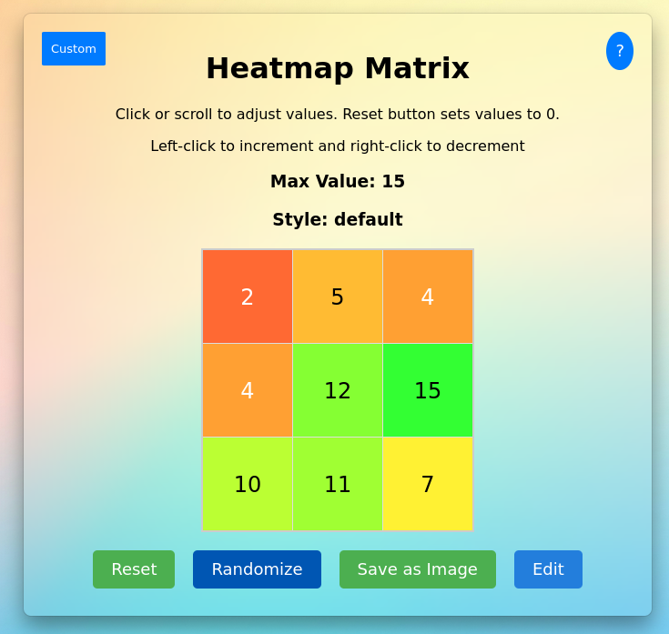

# Simple Heatmap Webpage

This project is a simple webpage that allows users to interact with a heatmap in the following ways:

- **Scrolling**: Users can scroll up and down to increment or decrement values within the heatmap.
- **Setting Random Values**: Users can set random values to populate the heatmap.
- **Saving Heatmap**: The heatmap can be saved as an image file.

## How to Use

1. **Scrolling**: Use your mouse or touchpad to scroll over the heatmap area to adjust values.
2. **Setting Random Values**: Click the "Randomize" button to fill the heatmap with randomly generated values.
3. **Saving Heatmap**: Click the "Save as Image" button to download the current heatmap as an image file.

## Functionality

- **Max Value**: You can set the maximum value of each cell using the "Custom" button. The maximum value can range from 0 to 30.
- **Styles**: Choose between two styles:
  - **Default**: Cell color hue is determined by its content value.
  - **Custom**: Allows custom colors for each value using a color picker.
- **Buttons**:
  - **Reset**: Sets all cell values back to 0.
  - **Randomize**: Assigns random values to all cells.
  - **Save as Image**: Downloads the current heatmap as a PNG image.
  - **Edit**: Toggle to manually edit cell values by clicking on them.

## Technologies Used

- HTML5, Vue.js for interactive functionality.
- CSS for styling the webpage.
- HTML2Canvas for generating image downloads.

## Setup Instructions

1. Clone this repository.
2. Open `index.html` in a web browser that supports HTML5 and JavaScript.

## Notes

- This is a basic implementation intended for demonstration purposes.
- Customize the appearance and behavior of the heatmap as per your requirements by modifying the JavaScript and CSS files.
